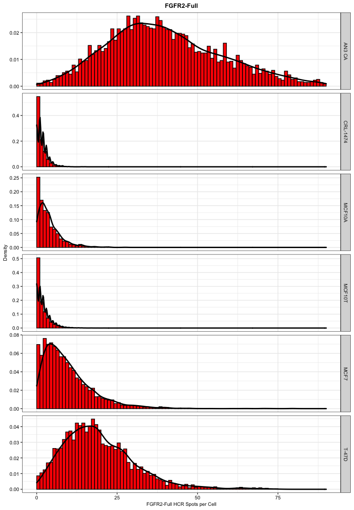
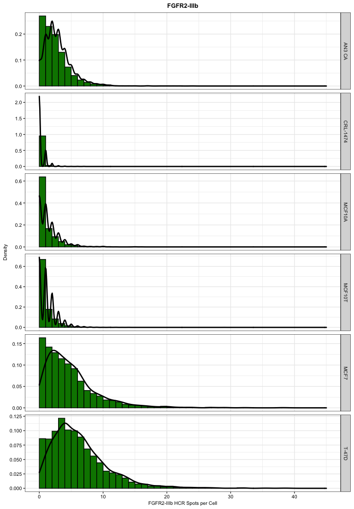
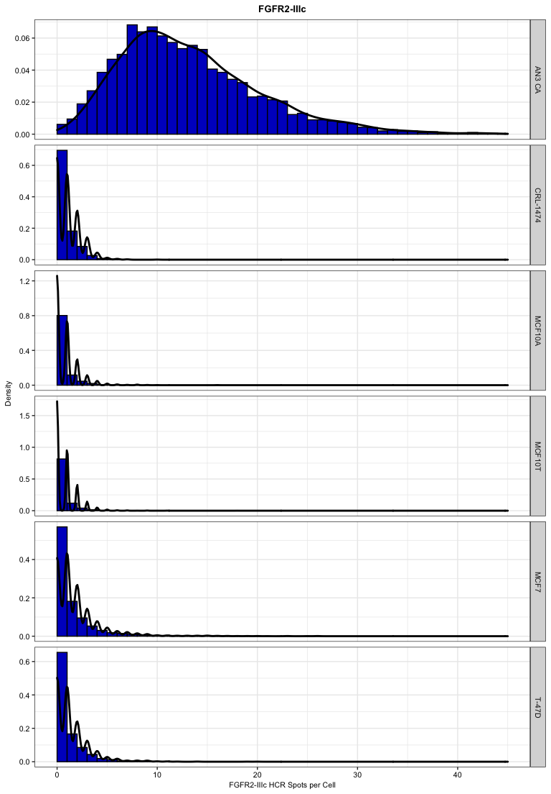

Figures 1I, 1J and 1K
================
Asaf Shilo/Gianluca Pegoraro
May 4th 2022

### Analysis setup

Load required packages.

``` r
library(plyr)
library(tidyverse)
```

    ## ── Attaching packages ─────────────────────────────────────── tidyverse 1.3.1 ──

    ## ✔ ggplot2 3.3.6     ✔ purrr   0.3.4
    ## ✔ tibble  3.1.7     ✔ dplyr   1.0.9
    ## ✔ tidyr   1.2.0     ✔ stringr 1.4.0
    ## ✔ readr   2.1.2     ✔ forcats 0.5.1

    ## ── Conflicts ────────────────────────────────────────── tidyverse_conflicts() ──
    ## ✖ dplyr::arrange()   masks plyr::arrange()
    ## ✖ purrr::compact()   masks plyr::compact()
    ## ✖ dplyr::count()     masks plyr::count()
    ## ✖ dplyr::failwith()  masks plyr::failwith()
    ## ✖ dplyr::filter()    masks stats::filter()
    ## ✖ dplyr::id()        masks plyr::id()
    ## ✖ dplyr::lag()       masks stats::lag()
    ## ✖ dplyr::mutate()    masks plyr::mutate()
    ## ✖ dplyr::rename()    masks plyr::rename()
    ## ✖ dplyr::summarise() masks plyr::summarise()
    ## ✖ dplyr::summarize() masks plyr::summarize()

``` r
library(data.table)
```

    ## 
    ## Attaching package: 'data.table'

    ## The following objects are masked from 'package:dplyr':
    ## 
    ##     between, first, last

    ## The following object is masked from 'package:purrr':
    ## 
    ##     transpose

``` r
library(stringr)
library(ggthemes)
library(ineq)
library(ggridges)
library(scales)
```

    ## 
    ## Attaching package: 'scales'

    ## The following object is masked from 'package:purrr':
    ## 
    ##     discard

    ## The following object is masked from 'package:readr':
    ## 
    ##     col_factor

Set output folder

### Read the experimental metadata

Read and change variable types in experimental metadata data.table

``` r
dt_md <- fread("metadata/layout.txt")
dt_md <- dt_md[probe != "",]
dt_md[, `:=`(probe = factor(probe, levels = c("FGFR2-IIIb", 
                                              "FGFR2-IIIc",
                                              "FGFR2-Full",
                                              "All",
                                              "None")))]
```

### Read and process the cell level data

Set RegEx patterns for directory searches for cell level data.

``` r
pat_c <- ".*Nuclei Final\\[0\\]\\.txt$" # Pattern for Single Cell data files
```

Create a list of the RegEx patterns set in the previous chunk.
**Important:** the list names will be carried over all the next steps!!!

-   c = cell level data

``` r
pat_list <- list(c= pat_c)
```

Recursively search the `input` directory and its subdirectories for
files whose name includes the RegEx patterns defined two chunks above.
The `path_list` functon outputs absolute file names. `path_list` is a
list containing all the filenames on a per cell-level.

``` r
list_files <- function(x) {
  dir(
  path = 'input/',
  pattern = x,
  full.names = TRUE,
  recursive = TRUE,
  include.dirs = TRUE
  )
}

path_list <- llply(pat_list, list_files) 
```

Extract file names from the absolute path and set them as list element
names.

``` r
trim_names <- function(x) {
  names(x) <-
  basename(x) # This assigns the filename to the file that it is read
  y <- x ## This is necessary because of scoping issues
}

path_list <- llply(path_list, trim_names) 
```

Recursively read and merge object level data files as data.frames. Rows
are labeled with relative filenames (The `.id` variable). This and the
previous chunks are slightly modified tricks adopted from H. Wickam
[“Tidy Data” paper](http://vita.had.co.nz/papers/tidy-data.pdf).

``` r
read_merge <- function(x) {
  dt <- as.data.table(ldply(x, fread, sep = "\t", na.strings = NULL))
}

dt_list <- llply(path_list, read_merge)
```

Separate the cell level data

``` r
dt_cell <- dt_list$c

rm(dt_list)
```

Change attribute names

``` r
setnames(
  dt_cell,
  c("Row",
    "Column",
    "ScreenName",
    "WellName",
    "Nuclei Final - Number of Positive 647- per Cell",
    "Nuclei Final - Number of Positive 562- per Cell",
    "Nuclei Final - Number of Positive 488- per Cell",
    "Nuclei Final - Nucleus Roundness"
    
  ),
  c("row",
    "column",
    "plate",
    "well",
    "spot_647_n",
    "spot_562_n",
    "spot_488_n",
    "roundness"
    
    )
  )
```

Join measurementa data with experimental metadata.

``` r
setkey(dt_md, row, column)
setkey(dt_cell, row, column)

dt_full <- dt_cell[dt_md, nomatch = 0] 
```

Creating probes datasets

### Plotting

Histogram Plot For FGFR2_Full Only Probes

<!-- -->

Histogram Plot For FGFR2_IIIb Only Probes

<!-- -->

Histogram Plot For FGFR2_IIIc Only Probes

<!-- -->

Document the information about the analysis session

``` r
sessionInfo()
```

    ## R version 4.2.0 (2022-04-22)
    ## Platform: x86_64-apple-darwin17.0 (64-bit)
    ## Running under: macOS Big Sur/Monterey 10.16
    ## 
    ## Matrix products: default
    ## BLAS:   /Library/Frameworks/R.framework/Versions/4.2/Resources/lib/libRblas.0.dylib
    ## LAPACK: /Library/Frameworks/R.framework/Versions/4.2/Resources/lib/libRlapack.dylib
    ## 
    ## locale:
    ## [1] en_US.UTF-8/en_US.UTF-8/en_US.UTF-8/C/en_US.UTF-8/en_US.UTF-8
    ## 
    ## attached base packages:
    ## [1] stats     graphics  grDevices utils     datasets  methods   base     
    ## 
    ## other attached packages:
    ##  [1] scales_1.2.0      ggridges_0.5.3    ineq_0.2-13       ggthemes_4.2.4   
    ##  [5] data.table_1.14.2 forcats_0.5.1     stringr_1.4.0     dplyr_1.0.9      
    ##  [9] purrr_0.3.4       readr_2.1.2       tidyr_1.2.0       tibble_3.1.7     
    ## [13] ggplot2_3.3.6     tidyverse_1.3.1   plyr_1.8.7       
    ## 
    ## loaded via a namespace (and not attached):
    ##  [1] tidyselect_1.1.2 xfun_0.30        haven_2.5.0      colorspace_2.0-3
    ##  [5] vctrs_0.4.1      generics_0.1.2   htmltools_0.5.2  yaml_2.3.5      
    ##  [9] utf8_1.2.2       rlang_1.0.2      pillar_1.7.0     withr_2.5.0     
    ## [13] glue_1.6.2       DBI_1.1.2        dbplyr_2.1.1     modelr_0.1.8    
    ## [17] readxl_1.4.0     lifecycle_1.0.1  munsell_0.5.0    gtable_0.3.0    
    ## [21] cellranger_1.1.0 rvest_1.0.2      evaluate_0.15    labeling_0.4.2  
    ## [25] knitr_1.39       tzdb_0.3.0       fastmap_1.1.0    fansi_1.0.3     
    ## [29] highr_0.9        broom_0.8.0      Rcpp_1.0.8.3     backports_1.4.1 
    ## [33] jsonlite_1.8.0   farver_2.1.0     fs_1.5.2         hms_1.1.1       
    ## [37] digest_0.6.29    stringi_1.7.6    grid_4.2.0       cli_3.3.0       
    ## [41] tools_4.2.0      magrittr_2.0.3   crayon_1.5.1     pkgconfig_2.0.3 
    ## [45] ellipsis_0.3.2   xml2_1.3.3       reprex_2.0.1     lubridate_1.8.0 
    ## [49] assertthat_0.2.1 rmarkdown_2.14   httr_1.4.2       rstudioapi_0.13 
    ## [53] R6_2.5.1         compiler_4.2.0
