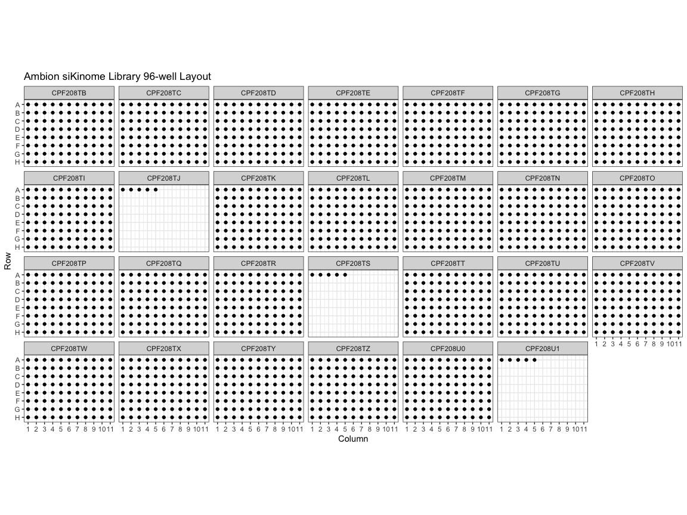
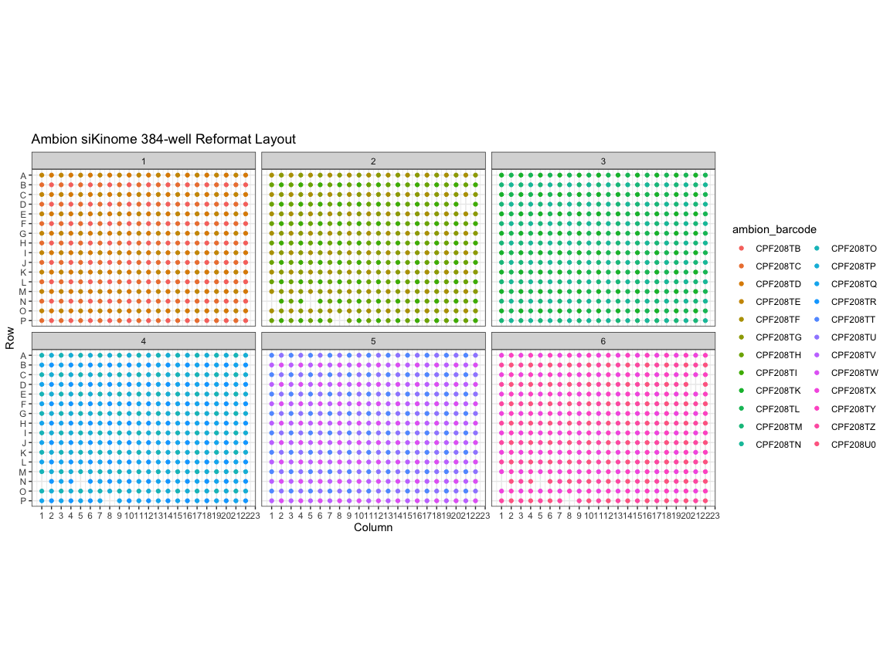
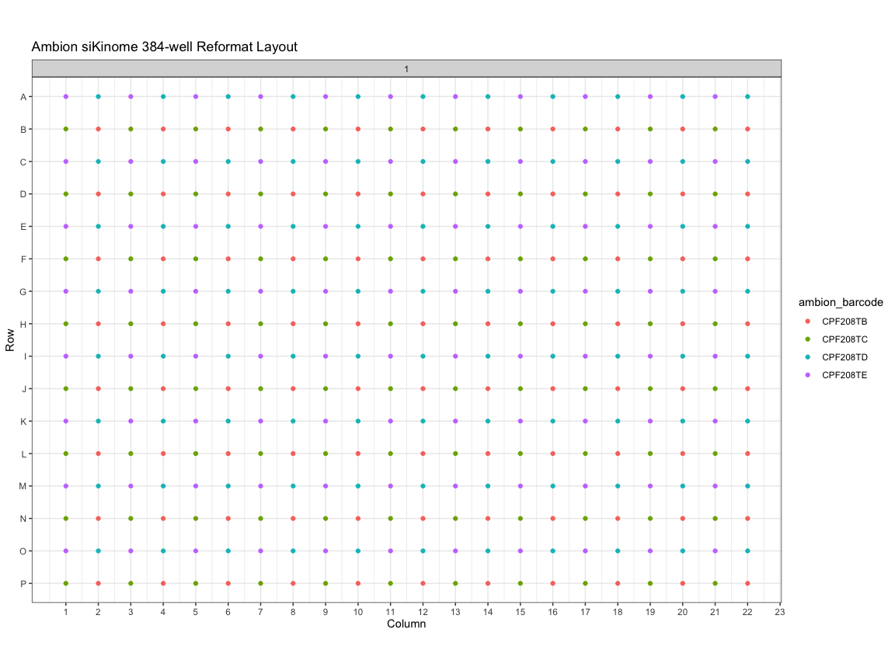

FGFR2 HCR siKinome Screen - No4 - Part 1 - cellHTS2 Data prep
================
Asaf Shilo/Gianluca Pegoraro
May 11th 2022

## README

This Script is used to generate the data formatted for `cellHTS2`
analysis.

## Setup

Load packages.

``` r
library(tidyverse)
```

    ## ── Attaching packages ─────────────────────────────────────── tidyverse 1.3.1 ──

    ## ✔ ggplot2 3.3.6     ✔ purrr   0.3.4
    ## ✔ tibble  3.1.7     ✔ dplyr   1.0.9
    ## ✔ tidyr   1.2.0     ✔ stringr 1.4.0
    ## ✔ readr   2.1.2     ✔ forcats 0.5.1

    ## ── Conflicts ────────────────────────────────────────── tidyverse_conflicts() ──
    ## ✖ dplyr::filter() masks stats::filter()
    ## ✖ dplyr::lag()    masks stats::lag()

``` r
library(readxl)
library(fs)
library(ineq)
```

### User variables input and settings specification

``` r
METADATA_DIR<- "hts2_metadata"

IN_DIR <- "hts2_input"

OUT_DIR <- "hts2_output"

OBJECT_DIR <- "Object_Data"

ROOT_DIR <- "reformatting_metadata"

AMBION_DIR <- file.path(ROOT_DIR, "Ambion_files")

RESUSP_DIR <- file.path(ROOT_DIR, "Resuspension")

COMP_DIR <- file.path(ROOT_DIR, "Compression")

STAMP_DIR <- file.path(ROOT_DIR, "Mother_Plates")

GLOB_PAT <- "*Nuclei Final[0].txt"
```

We specified the location of the Columbus .txt results file, the
original ThermoFisher files containing the identity and position of the
siRNA oligos in the 96-well plates (Object_Data), and of the metadata
obtained from the Janus logs
(reformatting_metadata/reformatting_metadata/Ambion_files,
reformatting_metadata/reformatting_metadata/Resuspension,
reformatting_metadata/reformatting_metadata/Compression, and
reformatting_metadata/reformatting_metadata/Mother_Plates ).

Generate the hts2_input directory for the well level Columbus data to be
used in the`cellHTS2` analysis. In addition, create an empty template
for the `cellHTS2` description file in the hts2_metadata directory.
**This file contains information about the experiment, and it must be
filled in in a text editor before continuing with the analysis. Without
this file cellHTS2 won’t run**.

``` r
if(!dir_exists(IN_DIR)){
dir_create(IN_DIR)
}

if(!file_exists(file.path(METADATA_DIR,"Description.txt"))) { 
    templateDescriptionFile(filename = "Description.txt", path = METADATA_DIR)
}
```

Set the `knitr` options and the `ggplot2` theme.

``` r
knitr::opts_chunk$set(
    cache = FALSE,
    fig.path = "output/",
    fig.height = 9,
    fig.width = 12,
    message = FALSE,
    warning = FALSE
    )

theme_set(theme_bw())
```

## Data and metadata input and wrangling

Read the siRNA layout information provided by ThermoFisher, rename some
variables, eliminate empty rows, and select only relevant columns.

``` r
names_selection <- syms(
  c(
    "Lot Number",
    "ambion_barcode",
    "Plate Name",
    "ambion_well",
    "Row",
    "Col",
    "RefSeq Accession Number",
    "Gene Symbol",
    "Full Gene Name",
    "Gene ID",
    "siRNA ID",
    "Exon(s) Targeted",
    "Sense siRNA Sequence",
    "Antisense siRNA Sequence",
    "Validated"
  )
)

gene_tbl <- dir_ls(path = AMBION_DIR,
                   glob = "*.xls") %>%
  map_df(read_excel,
          .id = "File_name") %>%
  rename(ambion_well = `Location (Row-Col)`,
         ambion_barcode = `Plate ID`) %>%
  filter(!is.na(`Gene ID`)) %>%
  select(!!!names_selection)

glimpse(gene_tbl)
```

    ## Rows: 2,127
    ## Columns: 15
    ## $ `Lot Number`               <chr> "4397918-AMO217T1-Si Sel Hm Kinase-01", "43…
    ## $ ambion_barcode             <chr> "CPF208TB", "CPF208TB", "CPF208TB", "CPF208…
    ## $ `Plate Name`               <chr> "Hm Kinase siRNA Lib V4-A1-1", "Hm Kinase s…
    ## $ ambion_well                <chr> "A1", "A2", "A3", "A4", "A5", "A6", "A7", "…
    ## $ Row                        <chr> "A", "A", "A", "A", "A", "A", "A", "A", "A"…
    ## $ Col                        <dbl> 1, 2, 3, 4, 5, 6, 7, 8, 9, 10, 11, 1, 2, 3,…
    ## $ `RefSeq Accession Number`  <chr> "NM_212469", "NM_001278", "NM_001823", "NM_…
    ## $ `Gene Symbol`              <chr> "CHKA", "CHUK", "CKB", "CKM", "CKMT1B", "CK…
    ## $ `Full Gene Name`           <chr> "choline kinase alpha", "conserved helix-lo…
    ## $ `Gene ID`                  <dbl> 1119, 1147, 1152, 1158, 1159, 1160, 1195, 1…
    ## $ `siRNA ID`                 <chr> "s223211", "s3076", "s3082", "s3094", "s223…
    ## $ `Exon(s) Targeted`         <chr> "7,6", "12", "7", "6", "7", "Not Determined…
    ## $ `Sense siRNA Sequence`     <chr> "CCAUCUCCAGUUGUAUUUUtt", "GGACUAAAAGAAGACUA…
    ## $ `Antisense siRNA Sequence` <chr> "AAAAUACAACUGGAGAUGGag", "UAUAGUCUUCUUUUAGU…
    ## $ Validated                  <lgl> NA, NA, NA, NA, NA, NA, NA, NA, NA, NA, NA,…

Read the Janus logs for resuspension, compression from 96- to 384-well
format into the `mother` plates and stamping into the `daughter` plates
(i.e. the Echo LDV-384 plates).

``` r
read_logs <- function(path,
                      ext = "*.xlsx",
                      src_rack,
                      src_well,
                      dest_rack,
                      dest_well) {
  source_rack_name <- enquo(src_rack)
  dest_rack_name <- enquo(dest_rack)
  source_well_name <- enquo(src_well)
  dest_well_name <- enquo(dest_well)
  
  dir_ls(path = path,
         glob = ext) %>%
    map_dfr(read_excel,
            .id = "file_name") %>%
    select(file_name,
           SrcRack,
           SrcWell,
           Rack,
           Well,
           quadrant = Tip,
           sample_id = SampleId) %>%
    filter(!(Rack == SrcRack)) %>%
    mutate(SrcRack = str_remove(SrcRack, "Q1_001")) %>%
    rename(
      !!source_rack_name := SrcRack,!!dest_rack_name := Rack,!!source_well_name := SrcWell,!!dest_well_name := Well
    )
}

resusp_tbl <- read_logs(
  path = RESUSP_DIR,
  src_rack = reservoir_barcode,
  dest_rack = ambion_barcode,
  src_well = reservoir_well,
  dest_well = ambion_well
)


compr_tbl <- read_logs(
  path = COMP_DIR,
  src_rack = ambion_barcode,
  dest_rack = mother_barcode,
  src_well = ambion_well,
  dest_well = mother_well
)


stamp_tbl <- read_logs(
  path = STAMP_DIR,
  src_rack = mother_barcode,
  dest_rack = daughter_barcode,
  src_well = mother_well,
  dest_well = daughter_well
)
```

### Download the data if needed

Download unzip the Columbus results of the experiments from Figshare if
they have not been already downloaded.

``` r
if(!dir.exists(OBJECT_DIR)) {
  URL <- ""
  curl_download(URL, "input.zip")
  unzip("input.zip")
}
```

### Read Columbus Data

Read the object-level Columbus data from the text files. The object
level data must be in the `OBJECT_DIR` and the file names *must match*
the \*Nuclei Final\[0\].txt `glob` pattern.

Calculate the well-level mean statistic for a variety of Columbus
measurements. Also calculate the Gini coefficient for `spots_488_n`,
`spots_561_n` and `spots_640_n`. Write the cumulative well-level results
in the hts2_input directory.

``` r
well_tbl <- cell_tbl %>% group_by(plate_index, 
                                  well_index,
                                  row,
                                  column) %>%
        mutate( 
                  spots_488_ratio = spots_488_n/cell_area,
                  spots_561_ratio = spots_561_n/cell_area,
                  spots_640_ratio = spots_640_n/cell_area,) %>%
                     
        summarise(cell_n = n(),
                  nuc_area_mean = mean(nuc_area, na.rm = T),
                  nuc_round_mean = mean(nuc_round, na.rm = T),
                  cell_area_mean = mean(cell_area, na.rm = T),
                  
                  TBP_spots_mean = mean(spots_561_n, na.rm = T),
                  TBP_spots_area_mean = mean(spots_561_ratio, na.rm = T),
                  TBP_ineq = Gini(spots_561_n),
                  
                  FGFR2_IIIB_spots_mean = mean(spots_488_n, na.rm = T),
                  FGFR2_IIIB_spots_area_mean = mean(spots_488_ratio, na.rm = T),
                  FGFR2_IIIB_ineq = Gini(spots_488_n),
                  
                  FGFR2_Full_spots_mean = mean(spots_640_n, na.rm = T),
                  FGFR2_Full_spots_area_mean = mean(spots_640_ratio, na.rm = T),
                  FGFR2_Full_ineq = Gini(spots_640_n), 
                  ) %>% 
            
            mutate(
                    FGFR2_IIIB_spots_Cell_Area_TBP_norm = FGFR2_IIIB_spots_area_mean / TBP_spots_area_mean,
                    FGFR2_Full_spots_Cell_Area_TBP_norm = FGFR2_Full_spots_area_mean / TBP_spots_area_mean,
                    FGFR2_IIIB_spots_Cell_Area_and_TBP_norm = FGFR2_IIIB_spots_area_mean / TBP_spots_mean,
                    FGFR2_Full_spots_Cell_Area_and_TBP_norm = FGFR2_Full_spots_area_mean / TBP_spots_mean, 
                    FGFR2_IIIB_spots_TBP_norm = FGFR2_IIIB_spots_mean / TBP_spots_mean,
                    FGFR2_Full_spots_TBP_norm = FGFR2_Full_spots_mean / TBP_spots_mean)%>%  
            
            arrange(plate_index, 
                    well_index,
                    row,
                    column) %>%
            ungroup()
 

write_tsv(well_tbl, file = file.path(IN_DIR, "Columbus_object_results.txt"))

glimpse(well_tbl)
```

    ## Rows: 2,304
    ## Columns: 23
    ## $ plate_index                             <chr> "HT000619", "HT000619", "HT000…
    ## $ well_index                              <chr> "A1", "A10", "A11", "A12", "A1…
    ## $ row                                     <dbl> 1, 1, 1, 1, 1, 1, 1, 1, 1, 1, …
    ## $ column                                  <dbl> 1, 10, 11, 12, 13, 14, 15, 16,…
    ## $ cell_n                                  <int> 1117, 1077, 1218, 865, 1078, 8…
    ## $ nuc_area_mean                           <dbl> 185.5893, 203.1941, 200.7228, …
    ## $ nuc_round_mean                          <dbl> 0.9687165, 0.9655972, 0.957111…
    ## $ cell_area_mean                          <dbl> 595.1725, 642.1328, 573.3177, …
    ## $ TBP_spots_mean                          <dbl> 23.66338, 27.18477, 27.66420, …
    ## $ TBP_spots_area_mean                     <dbl> 0.04240915, 0.04510244, 0.0510…
    ## $ TBP_ineq                                <dbl> 0.2149077, 0.1857506, 0.206585…
    ## $ FGFR2_IIIB_spots_mean                   <dbl> 7.275739, 4.444754, 4.544335, …
    ## $ FGFR2_IIIB_spots_area_mean              <dbl> 0.012541777, 0.007114898, 0.00…
    ## $ FGFR2_IIIB_ineq                         <dbl> 0.3458586, 0.3606840, 0.377883…
    ## $ FGFR2_Full_spots_mean                   <dbl> 17.80125, 15.29341, 15.52217, …
    ## $ FGFR2_Full_spots_area_mean              <dbl> 0.03072150, 0.02499334, 0.0281…
    ## $ FGFR2_Full_ineq                         <dbl> 0.2828953, 0.2624149, 0.275255…
    ## $ FGFR2_IIIB_spots_Cell_Area_TBP_norm     <dbl> 0.2957328, 0.1577497, 0.158673…
    ## $ FGFR2_Full_spots_Cell_Area_TBP_norm     <dbl> 0.7244073, 0.5541460, 0.552525…
    ## $ FGFR2_IIIB_spots_Cell_Area_and_TBP_norm <dbl> 0.0005300078, 0.0002617237, 0.…
    ## $ FGFR2_Full_spots_Cell_Area_and_TBP_norm <dbl> 0.0012982716, 0.0009193875, 0.…
    ## $ FGFR2_IIIB_spots_TBP_norm               <dbl> 0.3074682, 0.1635016, 0.164267…
    ## $ FGFR2_Full_spots_TBP_norm               <dbl> 0.7522700, 0.5625726, 0.561092…

Reorder the table.

``` r
well_tbl <- well_tbl[ ,c(1:14,18,20,22,15:16,19,21,23,17)]
```

Create input and output folder hierarchies in the hts2_input and
hts2_output directories, respectively.

``` r
well_tbl %>%
  select(cell_n:FGFR2_Full_ineq) %>%
  names() %>% walk(~ dir_create(file.path(IN_DIR, .x)))

well_tbl %>%
  select(cell_n:FGFR2_Full_ineq) %>%
  names() %>% walk(~ dir_create(file.path(OUT_DIR, .x)))
```

Assign a plate number to the Mother plates. For now this is a manual
operation.

``` r
run_tbl <- tibble(mother_barcode = c(paste0('HT000', seq(46, 51))),
                  plate_number = 1:6)

compr_tbl <- left_join(compr_tbl, run_tbl, by = 'mother_barcode')
```

Join well annotations from the Thernmo FISHER table with the logs
obtained from the Janus compression step.

``` r
join1 <- left_join(compr_tbl,
                   gene_tbl,
                   by = c("ambion_barcode", "ambion_well")) %>%
  select(
    ambion_barcode,
    ambion_well,
    plate_number,
    mother_barcode,
    mother_well,
    quadrant,
    sample_id,
    refseq_id = `RefSeq Accession Number`,
    gene_symbol = `Gene Symbol`,
    gene_name = `Full Gene Name`,
    gene_id = `Gene ID`,
    oligo_id = `siRNA ID`,
    exon = `Exon(s) Targeted`,
    sense = `Sense siRNA Sequence`,
    antisense = `Antisense siRNA Sequence`
  ) %>%
  mutate(mother_row = str_extract(mother_well, "[A-Z]"),
         mother_col = as.numeric(str_extract(mother_well, "[0-9]+"))) %>%
  filter(!(is.na(gene_symbol) | is.na(plate_number)))

glimpse(join1)
```

    ## Rows: 2,101
    ## Columns: 17
    ## $ ambion_barcode <chr> "CPF208TE", "CPF208TE", "CPF208TE", "CPF208TE", "CPF208…
    ## $ ambion_well    <chr> "A1", "B1", "C1", "D1", "E1", "F1", "G1", "H1", "A2", "…
    ## $ plate_number   <int> 1, 1, 1, 1, 1, 1, 1, 1, 1, 1, 1, 1, 1, 1, 1, 1, 1, 1, 1…
    ## $ mother_barcode <chr> "HT00046", "HT00046", "HT00046", "HT00046", "HT00046", …
    ## $ mother_well    <chr> "A1", "C1", "E1", "G1", "I1", "K1", "M1", "O1", "A3", "…
    ## $ quadrant       <dbl> 1, 2, 3, 4, 5, 6, 7, 8, 9, 10, 11, 12, 13, 14, 15, 16, …
    ## $ sample_id      <chr> "SRC0001", "SRC0002", "SRC0003", "SRC0004", "SRC0005", …
    ## $ refseq_id      <chr> "NM_002732", "NM_006257", "NM_002751", "NM_005044", "NM…
    ## $ gene_symbol    <chr> "PRKACG", "PRKCQ", "MAPK11", "PRKX", "ALDH18A1", "RPS6K…
    ## $ gene_name      <chr> "protein kinase, cAMP-dependent, catalytic, gamma", "pr…
    ## $ gene_id        <dbl> 5568, 5588, 5600, 5613, 5832, 6197, 6787, 7010, 5578, 5…
    ## $ oligo_id       <chr> "s224379", "s11122", "s11155", "s224410", "s11633", "s1…
    ## $ exon           <chr> "Not Determined", "2", "8", "Not Determined", "11,11", …
    ## $ sense          <chr> "AGGACAACUCCUACCUGUAtt", "GCGAGGCUGUUAACCCUUAtt", "GCGA…
    ## $ antisense      <chr> "UACAGGUAGGAGUUGUCCUta", "UAAGGGUUAACAGCCUCGCcc", "AGCU…
    ## $ mother_row     <chr> "A", "C", "E", "G", "I", "K", "M", "O", "A", "C", "E", …
    ## $ mother_col     <dbl> 1, 1, 1, 1, 1, 1, 1, 1, 3, 3, 3, 3, 3, 3, 3, 3, 5, 5, 5…

Join the resulting table (`join1`) with the logs from the stamping
plates step (Generation of the diluted daughter plates).

``` r
join2 <-
  left_join(stamp_tbl, join1, by = c("mother_barcode", "mother_well")) %>%
  select(
    ambion_barcode,
    ambion_well,
    plate_number,
    mother_barcode,
    mother_well,
    mother_row,
    mother_col,
    daughter_barcode,
    daughter_well,
    refseq_id ,
    gene_symbol,
    gene_name ,
    gene_id,
    oligo_id,
    exon,
    sense,
    antisense
  ) %>%
  filter(!is.na(refseq_id))

glimpse(join2)
```

    ## Rows: 6,303
    ## Columns: 17
    ## $ ambion_barcode   <chr> "CPF208TE", "CPF208TC", "CPF208TE", "CPF208TC", "CPF2…
    ## $ ambion_well      <chr> "A1", "A1", "B1", "B1", "C1", "C1", "D1", "D1", "E1",…
    ## $ plate_number     <int> 1, 1, 1, 1, 1, 1, 1, 1, 1, 1, 1, 1, 1, 1, 1, 1, 1, 1,…
    ## $ mother_barcode   <chr> "HT00046", "HT00046", "HT00046", "HT00046", "HT00046"…
    ## $ mother_well      <chr> "A1", "B1", "C1", "D1", "E1", "F1", "G1", "H1", "I1",…
    ## $ mother_row       <chr> "A", "B", "C", "D", "E", "F", "G", "H", "I", "J", "K"…
    ## $ mother_col       <dbl> 1, 1, 1, 1, 1, 1, 1, 1, 1, 1, 1, 1, 1, 1, 1, 1, 2, 2,…
    ## $ daughter_barcode <chr> "HT000415", "HT000415", "HT000415", "HT000415", "HT00…
    ## $ daughter_well    <chr> "A1", "B1", "C1", "D1", "E1", "F1", "G1", "H1", "I1",…
    ## $ refseq_id        <chr> "NM_002732", "NM_004333", "NM_006257", "NM_001222", "…
    ## $ gene_symbol      <chr> "PRKACG", "BRAF", "PRKCQ", "CAMK2G", "MAPK11", "INSRR…
    ## $ gene_name        <chr> "protein kinase, cAMP-dependent, catalytic, gamma", "…
    ## $ gene_id          <dbl> 5568, 673, 5588, 818, 5600, 3645, 5613, 3815, 5832, 1…
    ## $ oligo_id         <chr> "s224379", "s2080", "s11122", "s224890", "s11155", "s…
    ## $ exon             <chr> "Not Determined", "Not Determined", "2", "8,8,8,8", "…
    ## $ sense            <chr> "AGGACAACUCCUACCUGUAtt", "CAGAGGAUUUUAGUCUAUAtt", "GC…
    ## $ antisense        <chr> "UACAGGUAGGAGUUGUCCUta", "UAUAGACUAAAAUCCUCUGtt", "UA…

## siRNA oligos layout

<!-- -->

<!-- -->

<!-- -->

## `cellHTS2` data wrangling

### `Annotation`

Make the annotation file for `cellHTS2`, name it `Annotation.txt` and
save it to the in the hts2_input directory.

``` r
annotation_tbl <- join1 %>%
  select(
    Plate = plate_number,
    Well = mother_well,
    GeneID = gene_id,
    GeneSymbol = gene_symbol,
    siRNAID = oligo_id
  ) %>%
  mutate(Well = sprintf("%s%02d",
                        str_extract(Well, "\\w"),
                        as.numeric(str_extract(Well, "\\d+")))) %>%
  arrange(Plate, Well)

glimpse(annotation_tbl)
```

    ## Rows: 2,101
    ## Columns: 5
    ## $ Plate      <int> 1, 1, 1, 1, 1, 1, 1, 1, 1, 1, 1, 1, 1, 1, 1, 1, 1, 1, 1, 1,…
    ## $ Well       <chr> "A01", "A02", "A03", "A04", "A05", "A06", "A07", "A08", "A0…
    ## $ GeneID     <dbl> 5568, 2870, 5578, 2872, 5579, 2931, 5580, 2932, 5581, 2987,…
    ## $ GeneSymbol <chr> "PRKACG", "GRK6", "PRKCA", "MKNK2", "PRKCB", "GSK3A", "PRKC…
    ## $ siRNAID    <chr> "s224379", "s6090", "s11092", "s6093", "s11095", "s6236", "…

``` r
write_tsv(annotation_tbl,
          path = file.path(METADATA_DIR, "Annotation.txt"))
```

### `Plate Configuration`

Generate the configuration file `Plateconf.txt` for `cellHTS2` according
to the documentation specifications:

> The software expects this to be a rectangular table in a tabulator
> delimited text file, with mandatory columns Plate, Well, Content, plus
> two additional header lines that give the total number of wells and
> plates (see Table ?? for an example). The content of this file (except
> the two header lines) are stored in slot plateConf of x. As the name
> suggests, the Content column provides the content of each well in the
> plate (here referred to as the well annotation). Mainly, this
> annotation falls into four categories: empty wells, wells targeting
> genes of interest, control wells, and wells containing other things
> that do not fit in the previous categories. The first two types of
> wells should be indicated in the Content column of the plate
> configuration file by empty and sample, respectively, while the last
> type of wells should be indicated by other. The designation for the
> control wells in the Content column is more flexible. By default, the
> software expects them to be indicated by pos (for positive controls),
> or neg (for negative controls). However, other names are allowed,
> given that they are specified by the user whenever necessary (for
> example, when calling the writeReport function). This versatility for
> the control wells’ annotation is justified by the fact that,
> sometimes, multiple positive and/or negative controls can be employed
> in a given screen, making it useful to give different names to the
> distinct controls in the Content column. More- over, this versatility
> might be required in multi-channel screens for which we frequently
> have reporter-specific controls. The Well column contains the name of
> each well of the plate in alphanu- meric format (in this case, A01 to
> P24), while column Plate gives the plate number (1, 2, …). These two
> columns are also allowed to contain regular expressions. In the plate
> configuration file, each well and plate should be covered by a rule,
> and in case of multiple definitions only the last one is considered.
> For example, in the file shown in Table ??, the rule specified by the
> first line after the column header indicates that all of the wells in
> each of the 57 assay plate contain “sample”. However, a following rule
> indicate that the content of wells A01, A02 and B01 and B02 differ
> from “sample”, containing other material (in this case, “other” and
> controls). Note that the well annotations mentioned above are used by
> the software in the normalization, quality control, and gene selection
> calculations. Data from wells that are annotated as empty are ignored,
> i. e. they are set to NA.

The configuration file tells `cellHTS2` where the samples, controls and
empty wells are on each plate. The first 8 lines of the file (Headers
and controls positions) are hardcoded for now. The samples layout are is
appended from the processed information obtained from the Janus logs.

``` r
line1 <- "Wells: 384"
line2 <- "Plates: 6"
line3 <- "Plate\tWell\tContent"
line4 <- "*\t*\tempty"

odd_rows <- paste(LETTERS[seq(1, 16, by = 2)], collapse = ",")
even_rows <- paste(LETTERS[seq(2, 16, by = 2)], collapse = ",")

line5 <-
  paste0("*\t[", odd_rows, "]23\tneg") # sinon-targetting in Column 23 odd rows (A, C, ..., O)
line6 <-
  paste0("*\t[", even_rows, "]23\tpos") # allSTAR killer in Column 23 even rows (B, D, ..., P)
line7 <-
  paste0("*\t[", odd_rows, "]24\tcontrol1")  #  siESRP1 in Column 24 odd rows (A, C, ..., O)
line8 <-
  paste0("*\t[", even_rows, "]24\tcontrol2") # siESRP2 in Column 24 even rows (B, D, ..., P)

header <-  c(line1, line2, line3, line4, line5, line6, line7, line8)

header
```

    ## [1] "Wells: 384"                       "Plates: 6"                       
    ## [3] "Plate\tWell\tContent"             "*\t*\tempty"                     
    ## [5] "*\t[A,C,E,G,I,K,M,O]23\tneg"      "*\t[B,D,F,H,J,L,N,P]23\tpos"     
    ## [7] "*\t[A,C,E,G,I,K,M,O]24\tcontrol1" "*\t[B,D,F,H,J,L,N,P]24\tcontrol2"

``` r
# Write header to file
conf <- file(file.path(METADATA_DIR, "Plateconf.txt"), "w")
writeLines(header, conf)
close(conf)
```

The samples layout is appended from the processed information obtained
from the Janus logs and is written out to the the hts2_metadata
directory.

``` r
config_tbl <- annotation_tbl %>%
  select(Plate, Well) %>%
  mutate(Content = "sample")

glimpse(config_tbl)
```

    ## Rows: 2,101
    ## Columns: 3
    ## $ Plate   <int> 1, 1, 1, 1, 1, 1, 1, 1, 1, 1, 1, 1, 1, 1, 1, 1, 1, 1, 1, 1, 1,…
    ## $ Well    <chr> "A01", "A02", "A03", "A04", "A05", "A06", "A07", "A08", "A09",…
    ## $ Content <chr> "sample", "sample", "sample", "sample", "sample", "sample", "s…

``` r
write_tsv(config_tbl,
          path = file.path(METADATA_DIR, "Plateconf.txt"),
          append = T) # append 
```

### `Measurements`

Generate a `Master_Barcode_List.txt` file and save it in the working
directory (i.e. the same directory where the .Rmd file is). According to
the `cellHTS2` specifications, the file should have these columns:
`PlateName` (The plate barcode, as determined in the Janus log files, a
string), `Plate` (The plate number in the library, a number),
`Replicate` (Self explanatory, a number) and `Batch` (if the experiment
or replicate was run in different batches, not necessary). This file
contains the information on which plates have been analyzed, and on what
the internal organization of the run is. The `Master_Barcode_List.txt`
file is used to generate the measurement files to be read by `cellHTS2`.

``` r
barcodes_tbl <- read_tsv(file.path(METADATA_DIR, "Master_Barcode_List.txt"))

glimpse(barcodes_tbl)
```

    ## Rows: 6
    ## Columns: 4
    ## $ PlateName <chr> "HT000619", "HT000621", "HT000623", "HT000625", "HT000627", …
    ## $ Plate     <dbl> 1, 2, 3, 4, 5, 6
    ## $ Replicate <dbl> 1, 1, 1, 1, 1, 1
    ## $ Batch     <dbl> 1, 1, 1, 1, 1, 1

### `Plate List`

Generate and writeout the `cellHTS2` Platelist.txt file in the
hts2_input directory.

``` r
well_tbl %>%
  left_join(barcodes_tbl, by = c("plate_index" = "PlateName")) %>%
  pivot_longer(cols = cell_n:FGFR2_Full_ineq,
               names_to = "measurement",
               values_to = "value") %>%
  group_by(Plate, Replicate, Batch, measurement, plate_index) %>%
  group_keys() %>%
  mutate(Filename = paste0(plate_index, "_cellHTS2.txt")) %>%
  group_by(measurement) %>%
  group_walk(~ write_tsv(
    select(.x, Filename, Plate, Replicate, Batch),
    file.path(IN_DIR,
              .y$measurement,
              "Platelist.txt")
  ))

dir_info(path = IN_DIR,
         glob = "*.txt",
         recurse = T) %>% select(1:2)
```

    ## # A tibble: 134 × 2
    ##    path                                                                 type 
    ##    <fs::path>                                                           <fct>
    ##  1 hts2_input/Columbus_object_results.txt                               file 
    ##  2 hts2_input/FGFR2_Full_ineq/HT000619_cellHTS2.txt                     file 
    ##  3 hts2_input/FGFR2_Full_ineq/HT000621_cellHTS2.txt                     file 
    ##  4 hts2_input/FGFR2_Full_ineq/HT000623_cellHTS2.txt                     file 
    ##  5 hts2_input/FGFR2_Full_ineq/HT000625_cellHTS2.txt                     file 
    ##  6 hts2_input/FGFR2_Full_ineq/HT000627_cellHTS2.txt                     file 
    ##  7 hts2_input/FGFR2_Full_ineq/HT000629_cellHTS2.txt                     file 
    ##  8 hts2_input/FGFR2_Full_ineq/Platelist.txt                             file 
    ##  9 hts2_input/FGFR2_Full_spots_Cell_Area_TBP_norm/HT000619_cellHTS2.txt file 
    ## 10 hts2_input/FGFR2_Full_spots_Cell_Area_TBP_norm/HT000621_cellHTS2.txt file 
    ## # … with 124 more rows

Reformat the well names according to cellHTS2 specifications and write
out one `cellHTS2` measurement files on a per measurement, per plate
basis in the hts2_input directory.

``` r
meas_tbl <- 
  left_join(well_tbl, barcodes_tbl, by = c("plate_index" = "PlateName")) %>%
  
  mutate(well_index = sprintf("%s%02d",
                              str_extract(well_index, "\\w"),
                              as.numeric(str_extract(well_index, "\\d+"))))

meas_tbl %>% pivot_longer(cols = cell_n:FGFR2_Full_ineq,
                          values_to =  "Value",
                          names_to = "measurement") %>%
             group_by(measurement, plate_index) %>%
             group_walk( ~ write_tsv(
                select(.x, Plate, WellName = well_index, Value),
                file.path(IN_DIR,
                          .y$measurement,
                          paste0(.y$plate_index,
                                 "_cellHTS2.txt")),
                col_names = F,
                na = "NaN"
              ))

dir_info(path = IN_DIR,
         glob = "*_cellHTS2.txt",
         recurse = T) %>% select(1:2)
```

    ## # A tibble: 114 × 2
    ##    path                                                                 type 
    ##    <fs::path>                                                           <fct>
    ##  1 hts2_input/FGFR2_Full_ineq/HT000619_cellHTS2.txt                     file 
    ##  2 hts2_input/FGFR2_Full_ineq/HT000621_cellHTS2.txt                     file 
    ##  3 hts2_input/FGFR2_Full_ineq/HT000623_cellHTS2.txt                     file 
    ##  4 hts2_input/FGFR2_Full_ineq/HT000625_cellHTS2.txt                     file 
    ##  5 hts2_input/FGFR2_Full_ineq/HT000627_cellHTS2.txt                     file 
    ##  6 hts2_input/FGFR2_Full_ineq/HT000629_cellHTS2.txt                     file 
    ##  7 hts2_input/FGFR2_Full_spots_Cell_Area_TBP_norm/HT000619_cellHTS2.txt file 
    ##  8 hts2_input/FGFR2_Full_spots_Cell_Area_TBP_norm/HT000621_cellHTS2.txt file 
    ##  9 hts2_input/FGFR2_Full_spots_Cell_Area_TBP_norm/HT000623_cellHTS2.txt file 
    ## 10 hts2_input/FGFR2_Full_spots_Cell_Area_TBP_norm/HT000625_cellHTS2.txt file 
    ## # … with 104 more rows

Document the information about the analysis session

``` r
sessionInfo()
```

    ## R version 4.2.0 (2022-04-22)
    ## Platform: x86_64-apple-darwin17.0 (64-bit)
    ## Running under: macOS Big Sur/Monterey 10.16
    ## 
    ## Matrix products: default
    ## BLAS:   /Library/Frameworks/R.framework/Versions/4.2/Resources/lib/libRblas.0.dylib
    ## LAPACK: /Library/Frameworks/R.framework/Versions/4.2/Resources/lib/libRlapack.dylib
    ## 
    ## locale:
    ## [1] en_US.UTF-8/en_US.UTF-8/en_US.UTF-8/C/en_US.UTF-8/en_US.UTF-8
    ## 
    ## attached base packages:
    ## [1] stats     graphics  grDevices utils     datasets  methods   base     
    ## 
    ## other attached packages:
    ##  [1] ineq_0.2-13     fs_1.5.2        readxl_1.4.0    forcats_0.5.1  
    ##  [5] stringr_1.4.0   dplyr_1.0.9     purrr_0.3.4     readr_2.1.2    
    ##  [9] tidyr_1.2.0     tibble_3.1.7    ggplot2_3.3.6   tidyverse_1.3.1
    ## 
    ## loaded via a namespace (and not attached):
    ##  [1] tidyselect_1.1.2 xfun_0.30        haven_2.5.0      colorspace_2.0-3
    ##  [5] vctrs_0.4.1      generics_0.1.2   htmltools_0.5.2  yaml_2.3.5      
    ##  [9] utf8_1.2.2       rlang_1.0.2      pillar_1.7.0     glue_1.6.2      
    ## [13] withr_2.5.0      DBI_1.1.2        bit64_4.0.5      dbplyr_2.1.1    
    ## [17] modelr_0.1.8     lifecycle_1.0.1  munsell_0.5.0    gtable_0.3.0    
    ## [21] cellranger_1.1.0 rvest_1.0.2      evaluate_0.15    knitr_1.39      
    ## [25] tzdb_0.3.0       fastmap_1.1.0    parallel_4.2.0   fansi_1.0.3     
    ## [29] highr_0.9        broom_0.8.0      backports_1.4.1  scales_1.2.0    
    ## [33] vroom_1.5.7      jsonlite_1.8.0   farver_2.1.0     bit_4.0.4       
    ## [37] hms_1.1.1        digest_0.6.29    stringi_1.7.6    grid_4.2.0      
    ## [41] cli_3.3.0        tools_4.2.0      magrittr_2.0.3   crayon_1.5.1    
    ## [45] pkgconfig_2.0.3  ellipsis_0.3.2   xml2_1.3.3       reprex_2.0.1    
    ## [49] lubridate_1.8.0  assertthat_0.2.1 rmarkdown_2.14   httr_1.4.2      
    ## [53] rstudioapi_0.13  R6_2.5.1         compiler_4.2.0
