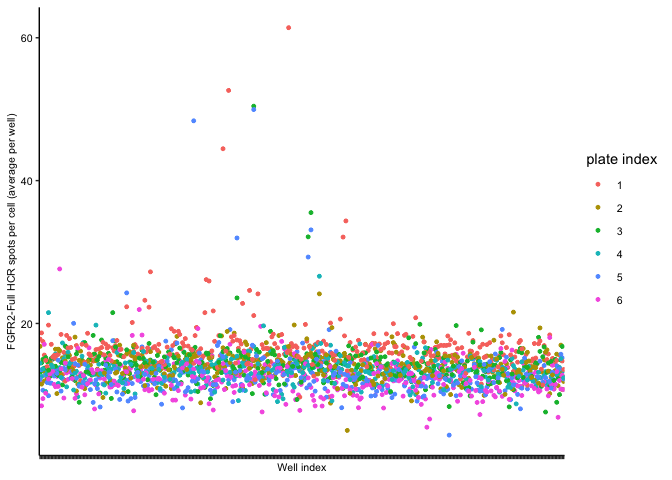
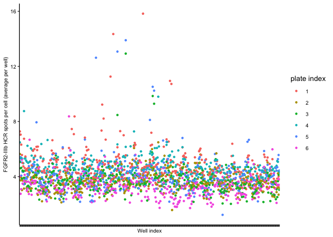
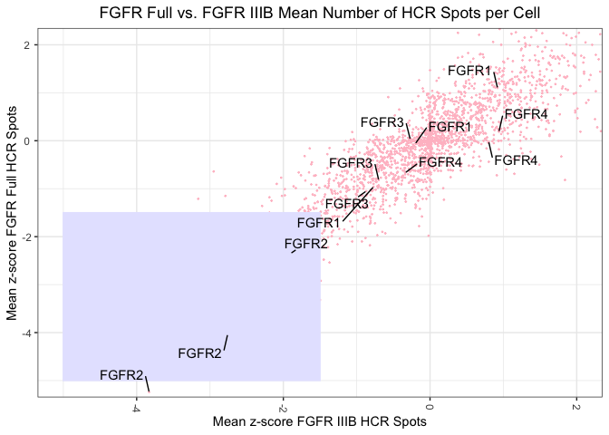

FGFR2 HCR siKinome Screen - No4 - Part 3 - Downstream analysis
================
Asaf Shilo/Gianluca Pegoraro
May 11th 2022

### Analysis Setup

``` r
library(tidyverse)
```

    ## ── Attaching packages ─────────────────────────────────────── tidyverse 1.3.1 ──

    ## ✔ ggplot2 3.3.6     ✔ purrr   0.3.4
    ## ✔ tibble  3.1.7     ✔ dplyr   1.0.9
    ## ✔ tidyr   1.2.0     ✔ stringr 1.4.0
    ## ✔ readr   2.1.2     ✔ forcats 0.5.1

    ## ── Conflicts ────────────────────────────────────────── tidyverse_conflicts() ──
    ## ✖ dplyr::filter() masks stats::filter()
    ## ✖ dplyr::lag()    masks stats::lag()

``` r
library(ggplot2)
library(fs)
```

### Read cellHTS2 analysis results

``` r
read_hts2_results <- function(path, glob) {
  dir_ls(path = path,
         recurse = T,
         glob = glob) %>%
    map_df(read_tsv,
           .id = "file_name")
}

glob_path <- "*Results_table.txt"
```

``` r
all_tbl <- read_hts2_results("hts2_output", glob_path) %>%
    filter(!(is.na(score) | wellAnno == "pos")) %>%
    mutate(prop = str_match(file_name, "hts2_output/(.*?)/")[,2]) %>%
    select(plate, 
           well, 
           control = wellAnno, 
           gene_id = GeneID,
           sirna_id = siRNAID,
           gene_symbol = GeneSymbol,
           prop,
           score,
           raw_repeat_1=raw_r1_ch1,
           ratio_repeat_1='raw/PlateMedian_r1_ch1',
           norm_repeat1=normalized_r1_ch1)       %>%   

    mutate(control = fct_recode(control,
                                siScramble = "neg",
                                Library = "sample",
                                siESRP1 = "control1",
                                siESRP2 = "control2"),
           control = fct_relevel(control, c("siScramble", 
                                            "Library", 
                                            "siESRP1",
                                            "siESRP2")))  %>%  
  pivot_wider(names_from=prop,
              values_from = c(score,
                              raw_repeat_1,
                              ratio_repeat_1,
                              norm_repeat1))
```

``` r
glimpse(all_tbl)
```

    ## Rows: 2,245
    ## Columns: 82
    ## $ plate                                                  <dbl> 1, 2, 5, 2, 3, …
    ## $ well                                                   <chr> "F14", "I13", "…
    ## $ control                                                <fct> Library, Librar…
    ## $ gene_id                                                <dbl> 5562, 9212, 534…
    ## $ sirna_id                                               <chr> "s100", "s17611…
    ## $ gene_symbol                                            <chr> "PRKAA1", "AURK…
    ## $ score_FGFR2_Full_ineq                                  <dbl> 10.92, 10.50, 1…
    ## $ score_FGFR2_Full_spots_Cell_Area_TBP_norm              <dbl> 0.61, -0.01, 5.…
    ## $ score_FGFR2_Full_spots_Cell_Area_and_TBP_norm          <dbl> -4.40, -2.75, -…
    ## $ score_FGFR2_Full_spots_TBP_norm                        <dbl> 0.52, -0.02, 6.…
    ## $ score_FGFR2_Full_spots_area_mean                       <dbl> 0.82, -0.01, -0…
    ## $ score_FGFR2_Full_spots_mean                            <dbl> 17.26, 6.33, 11…
    ## $ score_FGFR2_IIIB_ineq                                  <dbl> 6.23, 6.01, 3.6…
    ## $ score_FGFR2_IIIB_spots_Cell_Area_TBP_norm              <dbl> -0.02, 0.13, 6.…
    ## $ score_FGFR2_IIIB_spots_Cell_Area_and_TBP_norm          <dbl> -3.11, -2.35, -…
    ## $ score_FGFR2_IIIB_spots_TBP_norm                        <dbl> 0.00, 0.11, 7.2…
    ## $ score_FGFR2_IIIB_spots_area_mean                       <dbl> 0.09, 0.12, 0.7…
    ## $ score_FGFR2_IIIB_spots_mean                            <dbl> 12.21, 6.75, 11…
    ## $ score_TBP_ineq                                         <dbl> 15.95, 17.04, 1…
    ## $ score_TBP_spots_area_mean                              <dbl> -0.42, -0.04, -…
    ## $ score_TBP_spots_mean                                   <dbl> 34.96, 13.57, 3…
    ## $ score_cell_area_mean                                   <dbl> 20.35, 11.77, 1…
    ## $ score_cell_n                                           <dbl> -6.09, -6.68, -…
    ## $ score_nuc_area_mean                                    <dbl> 28.93, 20.04, 1…
    ## $ score_nuc_round_mean                                   <dbl> -9.64, -10.73, …
    ## $ raw_repeat_1_FGFR2_Full_ineq                           <dbl> 0.4376092, 0.44…
    ## $ raw_repeat_1_FGFR2_Full_spots_Cell_Area_TBP_norm       <dbl> 0.6680738, 0.56…
    ## $ raw_repeat_1_FGFR2_Full_spots_Cell_Area_and_TBP_norm   <dbl> 0.0004000905, 0…
    ## $ raw_repeat_1_FGFR2_Full_spots_TBP_norm                 <dbl> 0.6791720, 0.57…
    ## $ raw_repeat_1_FGFR2_Full_spots_area_mean                <dbl> 0.026193647, 0.…
    ## $ raw_repeat_1_FGFR2_Full_spots_mean                     <dbl> 44.464912, 24.1…
    ## $ raw_repeat_1_FGFR2_IIIB_ineq                           <dbl> 0.4817676, 0.49…
    ## $ raw_repeat_1_FGFR2_IIIB_spots_Cell_Area_TBP_norm       <dbl> 0.16291051, 0.1…
    ## $ raw_repeat_1_FGFR2_IIIB_spots_Cell_Area_and_TBP_norm   <dbl> 9.756251e-05, 1…
    ## $ raw_repeat_1_FGFR2_IIIB_spots_TBP_norm                 <dbl> 0.17197026, 0.1…
    ## $ raw_repeat_1_FGFR2_IIIB_spots_area_mean                <dbl> 0.006387349, 0.…
    ## $ raw_repeat_1_FGFR2_IIIB_spots_mean                     <dbl> 11.258772, 6.48…
    ## $ raw_repeat_1_TBP_ineq                                  <dbl> 0.3637607, 0.37…
    ## $ raw_repeat_1_TBP_spots_area_mean                       <dbl> 0.03920772, 0.0…
    ## $ raw_repeat_1_TBP_spots_mean                            <dbl> 65.46930, 42.19…
    ## $ raw_repeat_1_cell_area_mean                            <dbl> 1697.1205, 1152…
    ## $ raw_repeat_1_cell_n                                    <dbl> 228, 217, 137, …
    ## $ raw_repeat_1_nuc_area_mean                             <dbl> 462.3328, 364.7…
    ## $ raw_repeat_1_nuc_round_mean                            <dbl> 0.8997933, 0.87…
    ## $ ratio_repeat_1_FGFR2_Full_ineq                         <dbl> 1.54, 1.50, 1.5…
    ## $ ratio_repeat_1_FGFR2_Full_spots_Cell_Area_TBP_norm     <dbl> 0.954, 0.890, 1…
    ## $ ratio_repeat_1_FGFR2_Full_spots_Cell_Area_and_TBP_norm <dbl> 0.347, 0.464, 0…
    ## $ ratio_repeat_1_FGFR2_Full_spots_TBP_norm               <dbl> 0.938, 0.862, 1…
    ## $ ratio_repeat_1_FGFR2_Full_spots_area_mean              <dbl> 1.020, 0.948, 0…
    ## $ ratio_repeat_1_FGFR2_Full_spots_mean                   <dbl> 2.780, 1.730, 2…
    ## $ ratio_repeat_1_FGFR2_IIIB_ineq                         <dbl> 1.28, 1.24, 1.1…
    ## $ ratio_repeat_1_FGFR2_IIIB_spots_Cell_Area_TBP_norm     <dbl> 0.847, 0.914, 2…
    ## $ ratio_repeat_1_FGFR2_IIIB_spots_Cell_Area_and_TBP_norm <dbl> 0.305, 0.495, 0…
    ## $ ratio_repeat_1_FGFR2_IIIB_spots_TBP_norm               <dbl> 0.860, 0.906, 2…
    ## $ ratio_repeat_1_FGFR2_IIIB_spots_area_mean              <dbl> 0.884, 0.994, 1…
    ## $ ratio_repeat_1_FGFR2_IIIB_spots_mean                   <dbl> 2.500, 1.810, 2…
    ## $ ratio_repeat_1_TBP_ineq                                <dbl> 1.79, 1.82, 1.8…
    ## $ ratio_repeat_1_TBP_spots_area_mean                     <dbl> 1.070, 1.080, 0…
    ## $ ratio_repeat_1_TBP_spots_mean                          <dbl> 2.960, 2.050, 1…
    ## $ ratio_repeat_1_cell_area_mean                          <dbl> 2.650, 1.780, 2…
    ## $ ratio_repeat_1_cell_n                                  <dbl> 0.2330, 0.2220,…
    ## $ ratio_repeat_1_nuc_area_mean                           <dbl> 2.280, 1.780, 1…
    ## $ ratio_repeat_1_nuc_round_mean                          <dbl> 0.944, 0.917, 0…
    ## $ norm_repeat1_FGFR2_Full_ineq                           <dbl> 10.920, 10.497,…
    ## $ norm_repeat1_FGFR2_Full_spots_Cell_Area_TBP_norm       <dbl> 0.609, -0.006, …
    ## $ norm_repeat1_FGFR2_Full_spots_Cell_Area_and_TBP_norm   <dbl> -4.396, -2.751,…
    ## $ norm_repeat1_FGFR2_Full_spots_TBP_norm                 <dbl> 0.516, -0.025, …
    ## $ norm_repeat1_FGFR2_Full_spots_area_mean                <dbl> 0.821, -0.007, …
    ## $ norm_repeat1_FGFR2_Full_spots_mean                     <dbl> 17.256, 6.334, …
    ## $ norm_repeat1_FGFR2_IIIB_ineq                           <dbl> 6.235, 6.013, 3…
    ## $ norm_repeat1_FGFR2_IIIB_spots_Cell_Area_TBP_norm       <dbl> -0.021, 0.127, …
    ## $ norm_repeat1_FGFR2_IIIB_spots_Cell_Area_and_TBP_norm   <dbl> -3.114, -2.350,…
    ## $ norm_repeat1_FGFR2_IIIB_spots_TBP_norm                 <dbl> 0.001, 0.107, 7…
    ## $ norm_repeat1_FGFR2_IIIB_spots_area_mean                <dbl> 0.094, 0.116, 0…
    ## $ norm_repeat1_FGFR2_IIIB_spots_mean                     <dbl> 12.211, 6.755, …
    ## $ norm_repeat1_TBP_ineq                                  <dbl> 15.945, 17.044,…
    ## $ norm_repeat1_TBP_spots_area_mean                       <dbl> -0.424, -0.036,…
    ## $ norm_repeat1_TBP_spots_mean                            <dbl> 34.962, 13.570,…
    ## $ norm_repeat1_cell_area_mean                            <dbl> 20.347, 11.769,…
    ## $ norm_repeat1_cell_n                                    <dbl> -6.085, -6.682,…
    ## $ norm_repeat1_nuc_area_mean                             <dbl> 28.933, 20.036,…
    ## $ norm_repeat1_nuc_round_mean                            <dbl> -9.645, -10.733…

### Filterin operations

### Plot Figures

Figure 3B.

<!-- -->

Figure 3C.

<!-- -->

Figure 3F.

<!-- -->

Document the information about the analysis session

``` r
sessionInfo()
```

    ## R version 4.2.0 (2022-04-22)
    ## Platform: x86_64-apple-darwin17.0 (64-bit)
    ## Running under: macOS Big Sur/Monterey 10.16
    ## 
    ## Matrix products: default
    ## BLAS:   /Library/Frameworks/R.framework/Versions/4.2/Resources/lib/libRblas.0.dylib
    ## LAPACK: /Library/Frameworks/R.framework/Versions/4.2/Resources/lib/libRlapack.dylib
    ## 
    ## locale:
    ## [1] en_US.UTF-8/en_US.UTF-8/en_US.UTF-8/C/en_US.UTF-8/en_US.UTF-8
    ## 
    ## attached base packages:
    ## [1] stats     graphics  grDevices utils     datasets  methods   base     
    ## 
    ## other attached packages:
    ##  [1] fs_1.5.2        forcats_0.5.1   stringr_1.4.0   dplyr_1.0.9    
    ##  [5] purrr_0.3.4     readr_2.1.2     tidyr_1.2.0     tibble_3.1.7   
    ##  [9] ggplot2_3.3.6   tidyverse_1.3.1
    ## 
    ## loaded via a namespace (and not attached):
    ##  [1] ggrepel_0.9.1    Rcpp_1.0.8.3     lubridate_1.8.0  assertthat_0.2.1
    ##  [5] digest_0.6.29    utf8_1.2.2       R6_2.5.1         cellranger_1.1.0
    ##  [9] backports_1.4.1  reprex_2.0.1     evaluate_0.15    httr_1.4.2      
    ## [13] highr_0.9        pillar_1.7.0     rlang_1.0.2      readxl_1.4.0    
    ## [17] rstudioapi_0.13  rmarkdown_2.14   labeling_0.4.2   bit_4.0.4       
    ## [21] munsell_0.5.0    broom_0.8.0      compiler_4.2.0   modelr_0.1.8    
    ## [25] xfun_0.30        pkgconfig_2.0.3  htmltools_0.5.2  tidyselect_1.1.2
    ## [29] fansi_1.0.3      crayon_1.5.1     tzdb_0.3.0       dbplyr_2.1.1    
    ## [33] withr_2.5.0      grid_4.2.0       jsonlite_1.8.0   gtable_0.3.0    
    ## [37] lifecycle_1.0.1  DBI_1.1.2        magrittr_2.0.3   scales_1.2.0    
    ## [41] cli_3.3.0        stringi_1.7.6    vroom_1.5.7      farver_2.1.0    
    ## [45] xml2_1.3.3       ellipsis_0.3.2   generics_0.1.2   vctrs_0.4.1     
    ## [49] tools_4.2.0      bit64_4.0.5      glue_1.6.2       hms_1.1.1       
    ## [53] parallel_4.2.0   fastmap_1.1.0    yaml_2.3.5       colorspace_2.0-3
    ## [57] rvest_1.0.2      knitr_1.39       haven_2.5.0
