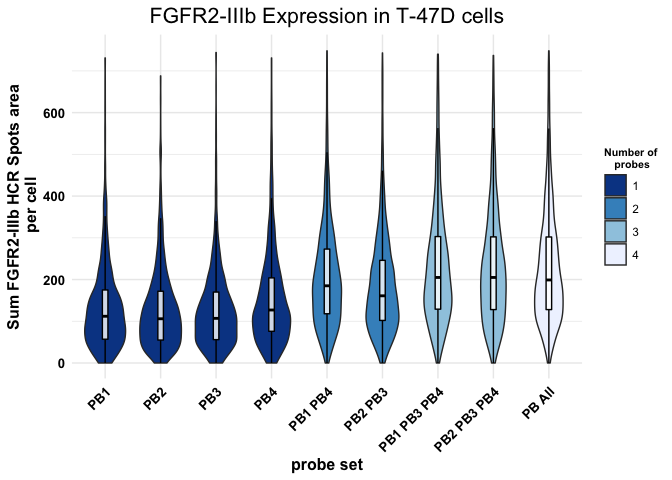
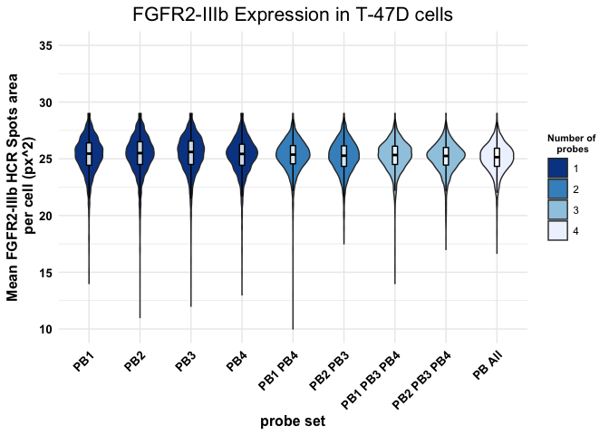
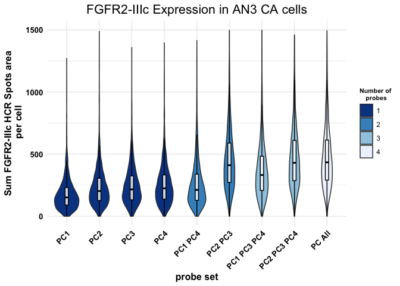
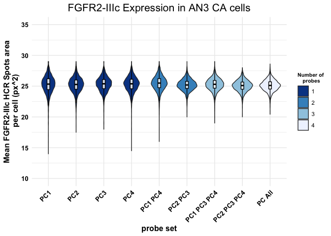

Figures S2A, S2B, S2C, and S2D
================
Asaf Shilo/Gianluca Pegoraro
Aug 31st 2022

### Read and Process the Object Level Data

Load required packages.

``` r
library(plyr)
library(tidyverse)
```

    ## ── Attaching packages ─────────────────────────────────────── tidyverse 1.3.1 ──

    ## ✔ ggplot2 3.3.6     ✔ purrr   0.3.4
    ## ✔ tibble  3.1.7     ✔ dplyr   1.0.9
    ## ✔ tidyr   1.2.0     ✔ stringr 1.4.0
    ## ✔ readr   2.1.2     ✔ forcats 0.5.1

    ## ── Conflicts ────────────────────────────────────────── tidyverse_conflicts() ──
    ## ✖ dplyr::arrange()   masks plyr::arrange()
    ## ✖ purrr::compact()   masks plyr::compact()
    ## ✖ dplyr::count()     masks plyr::count()
    ## ✖ dplyr::failwith()  masks plyr::failwith()
    ## ✖ dplyr::filter()    masks stats::filter()
    ## ✖ dplyr::id()        masks plyr::id()
    ## ✖ dplyr::lag()       masks stats::lag()
    ## ✖ dplyr::mutate()    masks plyr::mutate()
    ## ✖ dplyr::rename()    masks plyr::rename()
    ## ✖ dplyr::summarise() masks plyr::summarise()
    ## ✖ dplyr::summarize() masks plyr::summarize()

``` r
library(data.table)
```

    ## 
    ## Attaching package: 'data.table'

    ## The following objects are masked from 'package:dplyr':
    ## 
    ##     between, first, last

    ## The following object is masked from 'package:purrr':
    ## 
    ##     transpose

``` r
library(stringr)
library(ggthemes)
library(ineq)
library(ggridges)
library(viridis)
```

    ## Loading required package: viridisLite

``` r
library(readr)
library(curl)
```

    ## Using libcurl 7.79.1 with LibreSSL/3.3.6

    ## 
    ## Attaching package: 'curl'

    ## The following object is masked from 'package:readr':
    ## 
    ##     parse_date

Set Uotput folder

Set the palette and the running theme for ggplot2.

``` r
theme_set(theme_minimal())
theme_update(axis.text.x = element_text(
angle = -90,
hjust = 0,
vjust = 0.5
))
```

Read and Change variable types in experimental metadata data.table

``` r
dt_md <- fread("metadata/Layout.txt")
dt_md <- dt_md[probe != "",]
dt_md[, `:=`(probe = factor(probe, levels = c("PB1",
                                              "PB2",
                                              "PB3",
                                              "PB4",
                                              "PB1 PB4",
                                              "PB2 PB3",
                                              "PB1 PB3 PB4",
                                              "PB2 PB3 PB4",
                                              "PB All",
                                              "PC1",
                                              "PC2",
                                              "PC3",
                                              "PC4",
                                              "PC1 PC4",
                                              "PC2 PC3",
                                              "PC1 PC3 PC4",
                                              "PC2 PC3 PC4",
                                              "PC All",
                                              "None"
                                              )))]
```

### Download the data if needed

Download unzip the Columbus results of the experiments from Figshare if
they have not been already downloaded.

``` r
if(!dir.exists("ObjectLevelData")) {
  URL <- "https://figshare.com/ndownloader/files/36988114"
  curl_download(URL, "input.zip")
  unzip("input.zip")
}
```

### Read and process the cell level data

Set RegEx patterns for directory searches for cell level data.

``` r
pat_c <- ".*Nuclei Final\\[0\\]\\.txt$" # Pattern for Single Cell data files
```

Create a list of the RegEx patterns set in the previous chunk.
**Important:** the list names will be carried over all the next steps!!!

-   c = cell level data

``` r
pat_list <- list(c= pat_c)
```

Recursively search the `ObjectLevelData` directory and its
subdirectories for files whose name includes the RegEx patterns defined
two chunks above. The `path_list` functon outputs absolute file names.
`path_list` is a list containing all the filenames on a per cell-level.

``` r
list_files <- function(x) {
  dir(
  path = 'ObjectLevelData/',
  pattern = x,
  full.names = TRUE,
  recursive = TRUE,
  include.dirs = TRUE
  )
}

path_list <- llply(pat_list, list_files) 
```

Extract file names from absolut path and set them as list element names.

``` r
trim_names <- function(x) {
  names(x) <-
  basename(x) # This assigns the filename to the file that it is read
  y <- x ## This is necessary because of scoping issues
}

path_list <- llply(path_list, trim_names) 
```

Recursively read and merge object level data files as data.frames. Rows
are labeled with relative filenames (The `.id` variable). This and the
previous chunks are slightly modified tricks adopted from H. Wickam
[“Tidy Data” paper](http://vita.had.co.nz/papers/tidy-data.pdf).

``` r
read_merge <- function(x) {
  dt <- as.data.table(ldply(x, fread, sep = "\t", na.strings = NULL))
}

dt_list <- llply(path_list, read_merge)
```

Separate the cell level data.

``` r
dt_cell <- dt_list$c

rm(dt_list)
```

Change variables names.

``` r
setnames(
  dt_cell,
  c("Row",
    "Column",
    "ScreenName",
    "WellName",
    "Nuclei Final - Number of Positive 488- per Cell",
    "Nuclei Final - Intensity Spot 488 Mean- Mean per Cell",
    "Nuclei Final - Intensity Spot 488 Mean- Sum per Cell",
    "Nuclei Final - Spot Area [px²]- Mean per Cell",
    "Nuclei Final - Spot Area [px²]- Sum per Cell"
  ),
  c("row",
    "column",
    "plate",
    "well",
    "spot_488_n",
    "Mean_spot_intensity_488",
    "Sum_spot_intensity_488",
    "Mean_spot_area_488",
    "Sum_spot_area_488"
    )
 )
```

Join measurement data with experimental metadata.

``` r
setkey(dt_md, row, column)
setkey(dt_cell, row, column)

dt_full <- dt_cell[dt_md, nomatch = 0] 
```

Generate datasets for plotting.

``` r
dt_T47D <- filter(dt_full,cell_line == "T47D" & probe !="None")
dt_T47D_PB <- dt_T47D%>%filter(!grepl('PC', probe))
dt_T47D_PC <- dt_T47D%>%filter(!grepl('PB', probe))                              
dt_AN3 <- filter(dt_full,cell_line == "AN3" & probe !="None")
dt_AN3_PC <- dt_AN3%>%filter(!grepl('PB', probe))
dt_AN3_PB <- dt_AN3%>%filter(!grepl('PC', probe))
```

### Plotting

Plotting FGFR2_IIIB sum spot area in T47D cells

<!-- -->

Plotting FGFR2_IIIB mean spot area in T47D cells

<!-- -->

Plotting FGFR2_IIIc sum spot area in AN3CA cells

<!-- -->

Plotting FGFR2_IIIc mean spot area in AN3CA cells

<!-- -->

Document the information about the analysis session

``` r
sessionInfo()
```

    ## R version 4.2.1 (2022-06-23)
    ## Platform: x86_64-apple-darwin17.0 (64-bit)
    ## Running under: macOS Big Sur ... 10.16
    ## 
    ## Matrix products: default
    ## BLAS:   /Library/Frameworks/R.framework/Versions/4.2/Resources/lib/libRblas.0.dylib
    ## LAPACK: /Library/Frameworks/R.framework/Versions/4.2/Resources/lib/libRlapack.dylib
    ## 
    ## locale:
    ## [1] en_US.UTF-8/en_US.UTF-8/en_US.UTF-8/C/en_US.UTF-8/en_US.UTF-8
    ## 
    ## attached base packages:
    ## [1] stats     graphics  grDevices utils     datasets  methods   base     
    ## 
    ## other attached packages:
    ##  [1] curl_4.3.2        viridis_0.6.2     viridisLite_0.4.0 ggridges_0.5.3   
    ##  [5] ineq_0.2-13       ggthemes_4.2.4    data.table_1.14.2 forcats_0.5.1    
    ##  [9] stringr_1.4.0     dplyr_1.0.9       purrr_0.3.4       readr_2.1.2      
    ## [13] tidyr_1.2.0       tibble_3.1.7      ggplot2_3.3.6     tidyverse_1.3.1  
    ## [17] plyr_1.8.7       
    ## 
    ## loaded via a namespace (and not attached):
    ##  [1] Rcpp_1.0.8.3       lubridate_1.8.0    assertthat_0.2.1   digest_0.6.29     
    ##  [5] utf8_1.2.2         R6_2.5.1           cellranger_1.1.0   backports_1.4.1   
    ##  [9] reprex_2.0.1       evaluate_0.15      highr_0.9          httr_1.4.4        
    ## [13] pillar_1.7.0       rlang_1.0.4        readxl_1.4.0       rstudioapi_0.14   
    ## [17] rmarkdown_2.14     labeling_0.4.2     munsell_0.5.0      broom_0.8.0       
    ## [21] compiler_4.2.1     modelr_0.1.8       xfun_0.30          pkgconfig_2.0.3   
    ## [25] htmltools_0.5.2    tidyselect_1.1.2   gridExtra_2.3      fansi_1.0.3       
    ## [29] crayon_1.5.1       tzdb_0.3.0         dbplyr_2.1.1       withr_2.5.0       
    ## [33] grid_4.2.1         jsonlite_1.8.0     gtable_0.3.0       lifecycle_1.0.1   
    ## [37] DBI_1.1.2          magrittr_2.0.3     scales_1.2.0       cli_3.3.0         
    ## [41] stringi_1.7.6      farver_2.1.0       fs_1.5.2           xml2_1.3.3        
    ## [45] ellipsis_0.3.2     generics_0.1.2     vctrs_0.4.1        RColorBrewer_1.1-3
    ## [49] tools_4.2.1        glue_1.6.2         hms_1.1.1          fastmap_1.1.0     
    ## [53] yaml_2.3.5         colorspace_2.0-3   rvest_1.0.2        knitr_1.39        
    ## [57] haven_2.5.0
