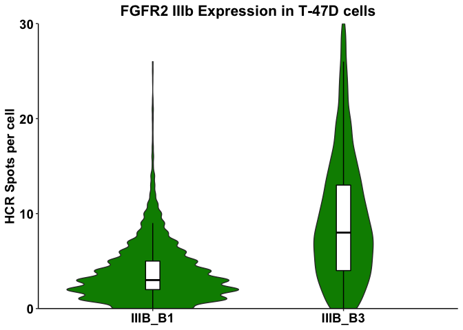

Figure S2A
================
Asaf Shilo/Gianluca Pegoraro
May 12th 2022

### Analysis setup

Load required packages.

``` r
library(plyr)
library(tidyverse)
```

    ## ── Attaching packages ─────────────────────────────────────── tidyverse 1.3.1 ──

    ## ✔ ggplot2 3.3.6     ✔ purrr   0.3.4
    ## ✔ tibble  3.1.7     ✔ dplyr   1.0.9
    ## ✔ tidyr   1.2.0     ✔ stringr 1.4.0
    ## ✔ readr   2.1.2     ✔ forcats 0.5.1

    ## ── Conflicts ────────────────────────────────────────── tidyverse_conflicts() ──
    ## ✖ dplyr::arrange()   masks plyr::arrange()
    ## ✖ purrr::compact()   masks plyr::compact()
    ## ✖ dplyr::count()     masks plyr::count()
    ## ✖ dplyr::failwith()  masks plyr::failwith()
    ## ✖ dplyr::filter()    masks stats::filter()
    ## ✖ dplyr::id()        masks plyr::id()
    ## ✖ dplyr::lag()       masks stats::lag()
    ## ✖ dplyr::mutate()    masks plyr::mutate()
    ## ✖ dplyr::rename()    masks plyr::rename()
    ## ✖ dplyr::summarise() masks plyr::summarise()
    ## ✖ dplyr::summarize() masks plyr::summarize()

``` r
library(data.table)
```

    ## 
    ## Attaching package: 'data.table'

    ## The following objects are masked from 'package:dplyr':
    ## 
    ##     between, first, last

    ## The following object is masked from 'package:purrr':
    ## 
    ##     transpose

``` r
library(stringr)
library(ggthemes)
library(dplyr)
library(curl)
```

    ## Using libcurl 7.79.1 with LibreSSL/3.3.5

    ## 
    ## Attaching package: 'curl'

    ## The following object is masked from 'package:readr':
    ## 
    ##     parse_date

Set the palette and the running theme for ggplot2.

``` r
theme_set(theme_minimal())
theme_update(axis.text.x = element_text(
angle = -90,
hjust = 0,
vjust = 0.5
))
```

### Read the experimental metadata

Read and change variable types in experimental metadata data.table.

``` r
dt_md <- fread("metadata/layout.txt")
dt_md <- dt_md[probe != "",]
dt_md[, `:=`(probe = factor(probe, levels = c("IIIB_B1",
                                              "IIIB_B3",
                                              "None")))]
```

### Download the data if needed

Download unzip the Columbus results of the experiments from Figshare if
they have not been already downloaded.

``` r
if(!dir.exists("ObjectLevelData")) {
  URL <- "https://figshare.com/ndownloader/files/35014996"
  curl_download(URL, "input.zip")
  unzip("input.zip")
}
```

### Read and process the cell level data

Set RegEx patterns for directory searches for cell level data.

``` r
pat_c <- ".*Nuclei Final\\[0\\]\\.txt$" # Pattern for Single Cell data files
```

Create a list of the RegEx patterns set in the previous chunk.
**Important:** the list names will be carried over all the next steps!!!

-   c = cell level data

``` r
pat_list <- list(c= pat_c)
```

Recursively search the `ObjectLevelData` directory and its
sub-directories for files whose name includes the RegEx patterns defined
two chunks above. The `path_list` function outputs absolute file names.
`path_list` is a list containing all the file names on a per cell-level.

``` r
list_files <- function(x) {
  dir(
  path = 'ObjectLevelData/',
  pattern = x,
  full.names = TRUE,
  recursive = TRUE,
  include.dirs = TRUE
  )
}

path_list <- llply(pat_list, list_files) 
```

Extract file names from absolute path and set them as list element
names.

``` r
trim_names <- function(x) {
  names(x) <-
  basename(x) # This assigns the filename to the file that it is read
  y <- x ## This is necessary because of scoping issues
}

path_list <- llply(path_list, trim_names) 
```

Recursively read and merge object level data files as data.frames. Rows
are labeled with relative filenames (The `.id` variable). This and the
previous chunks are slightly modified tricks adopted from H. Wickam
[“Tidy Data” paper](http://vita.had.co.nz/papers/tidy-data.pdf).

``` r
read_merge <- function(x) {
  dt <- as.data.table(ldply(x, fread, sep = "\t", na.strings = NULL))
}

dt_list <- llply(path_list, read_merge)
```

Separate the cell level data.

``` r
dt_cell <- dt_list$c

rm(dt_list)
```

Change variables names.

``` r
setnames(
  dt_cell,
  c("Row",
    "Column",
    "ScreenName",
    "WellName",
    "Nuclei Final - Number of Positive 647- per Cell",
    "Nuclei Final - Number of Positive 488- per Cell"
  ),
  c("row",
    "column",
    "plate",
    "well",
    "B3_Far_Red",
    "B1_Green")
  )
```

Join measurement data with experimental metadata.

``` r
setkey(dt_md, row, column)
setkey(dt_cell, row, column)

dt_full <- dt_cell[dt_md, nomatch = 0] 
```

Generate datasets for plotting.

``` r
dt_ctrl <- subset(dt_full, Treatment != "si_FGFR2")
dt_1 <- subset(dt_ctrl, probe == "IIIB_B1")
dt_2 <- dt_1
names (dt_2) [22] <-'spot_N'
dt_3 <-select (dt_2, c(8:13, 22:25))

dt_1.1 <- subset(dt_ctrl, probe == "IIIB_B3")
dt_2.1 <- dt_1.1
names (dt_2.1) [21] <-'spot_N'
dt_3.1 <-select (dt_2.1, c(8:13,21, 23:25))

dt_all <- rbind(dt_3, dt_3.1)
```

### Plotting

Plotting FGFRII-IIIB data from T-47D cells.

<!-- -->

Document the information about the analysis session.

``` r
sessionInfo()
```

    ## R version 4.2.0 (2022-04-22)
    ## Platform: x86_64-apple-darwin17.0 (64-bit)
    ## Running under: macOS Big Sur/Monterey 10.16
    ## 
    ## Matrix products: default
    ## BLAS:   /Library/Frameworks/R.framework/Versions/4.2/Resources/lib/libRblas.0.dylib
    ## LAPACK: /Library/Frameworks/R.framework/Versions/4.2/Resources/lib/libRlapack.dylib
    ## 
    ## locale:
    ## [1] en_US.UTF-8/en_US.UTF-8/en_US.UTF-8/C/en_US.UTF-8/en_US.UTF-8
    ## 
    ## attached base packages:
    ## [1] stats     graphics  grDevices utils     datasets  methods   base     
    ## 
    ## other attached packages:
    ##  [1] curl_4.3.2        ggthemes_4.2.4    data.table_1.14.2 forcats_0.5.1    
    ##  [5] stringr_1.4.0     dplyr_1.0.9       purrr_0.3.4       readr_2.1.2      
    ##  [9] tidyr_1.2.0       tibble_3.1.7      ggplot2_3.3.6     tidyverse_1.3.1  
    ## [13] plyr_1.8.7       
    ## 
    ## loaded via a namespace (and not attached):
    ##  [1] tidyselect_1.1.2 xfun_0.30        haven_2.5.0      colorspace_2.0-3
    ##  [5] vctrs_0.4.1      generics_0.1.2   htmltools_0.5.2  yaml_2.3.5      
    ##  [9] utf8_1.2.2       rlang_1.0.2      pillar_1.7.0     withr_2.5.0     
    ## [13] glue_1.6.2       DBI_1.1.2        dbplyr_2.1.1     modelr_0.1.8    
    ## [17] readxl_1.4.0     lifecycle_1.0.1  munsell_0.5.0    gtable_0.3.0    
    ## [21] cellranger_1.1.0 rvest_1.0.2      evaluate_0.15    labeling_0.4.2  
    ## [25] knitr_1.39       tzdb_0.3.0       fastmap_1.1.0    fansi_1.0.3     
    ## [29] highr_0.9        broom_0.8.0      Rcpp_1.0.8.3     backports_1.4.1 
    ## [33] scales_1.2.0     jsonlite_1.8.0   farver_2.1.0     fs_1.5.2        
    ## [37] hms_1.1.1        digest_0.6.29    stringi_1.7.6    grid_4.2.0      
    ## [41] cli_3.3.0        tools_4.2.0      magrittr_2.0.3   crayon_1.5.1    
    ## [45] pkgconfig_2.0.3  ellipsis_0.3.2   xml2_1.3.3       reprex_2.0.1    
    ## [49] lubridate_1.8.0  assertthat_0.2.1 rmarkdown_2.14   httr_1.4.2      
    ## [53] rstudioapi_0.13  R6_2.5.1         compiler_4.2.0
