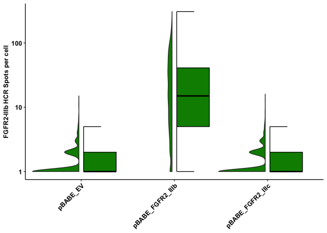

Figures S6A, S6B, S6C, and S6D
================
Asaf Shilo/Gianluca Pegoraro
August 31st 2022

### Read and Process the Object Level Data

Load required packages.

``` r
library(plyr)
library(tidyverse)
```

    ## ── Attaching packages ─────────────────────────────────────── tidyverse 1.3.1 ──

    ## ✔ ggplot2 3.3.6     ✔ purrr   0.3.4
    ## ✔ tibble  3.1.7     ✔ dplyr   1.0.9
    ## ✔ tidyr   1.2.0     ✔ stringr 1.4.0
    ## ✔ readr   2.1.2     ✔ forcats 0.5.1

    ## ── Conflicts ────────────────────────────────────────── tidyverse_conflicts() ──
    ## ✖ dplyr::arrange()   masks plyr::arrange()
    ## ✖ purrr::compact()   masks plyr::compact()
    ## ✖ dplyr::count()     masks plyr::count()
    ## ✖ dplyr::failwith()  masks plyr::failwith()
    ## ✖ dplyr::filter()    masks stats::filter()
    ## ✖ dplyr::id()        masks plyr::id()
    ## ✖ dplyr::lag()       masks stats::lag()
    ## ✖ dplyr::mutate()    masks plyr::mutate()
    ## ✖ dplyr::rename()    masks plyr::rename()
    ## ✖ dplyr::summarise() masks plyr::summarise()
    ## ✖ dplyr::summarize() masks plyr::summarize()

``` r
library(data.table)
```

    ## 
    ## Attaching package: 'data.table'

    ## The following objects are masked from 'package:dplyr':
    ## 
    ##     between, first, last

    ## The following object is masked from 'package:purrr':
    ## 
    ##     transpose

``` r
library(stringr)
library(ggthemes)
library(ggpubr)
```

    ## 
    ## Attaching package: 'ggpubr'

    ## The following object is masked from 'package:plyr':
    ## 
    ##     mutate

``` r
library(gghalves)
library(rstatix)
```

    ## 
    ## Attaching package: 'rstatix'

    ## The following objects are masked from 'package:plyr':
    ## 
    ##     desc, mutate

    ## The following object is masked from 'package:stats':
    ## 
    ##     filter

``` r
library(FSA)
```

    ## Registered S3 methods overwritten by 'FSA':
    ##   method       from
    ##   confint.boot car 
    ##   hist.boot    car

    ## ## FSA v0.9.3. See citation('FSA') if used in publication.
    ## ## Run fishR() for related website and fishR('IFAR') for related book.

    ## 
    ## Attaching package: 'FSA'

    ## The following object is masked from 'package:plyr':
    ## 
    ##     mapvalues

``` r
library(curl)
```

    ## Using libcurl 7.79.1 with LibreSSL/3.3.6

    ## 
    ## Attaching package: 'curl'

    ## The following object is masked from 'package:readr':
    ## 
    ##     parse_date

Set output folder.

Set the palette and the running theme for ggplot2.

``` r
theme_set(theme_minimal())
theme_update(axis.text.x = element_text(
angle = -90,
hjust = 0,
vjust = 0.5
))
```

Read and Change variable types in experimental metadata data.table

``` r
dt_md <- fread("metaData/Layout.txt")
dt_md <- dt_md[probe != "",]
dt_md[, `:=`(probe = factor(probe, levels = c("None", 
                                              "FGFR2_Full",
                                              "FGFR2_IIIb",
                                              "FGFR2_IIIc",
                                              "TBP",
                                              "FGFR2_D7_10",
                                              "FGFR2_D7_10_B3",
                                              "All_IIIb",
                                              "All_IIIc" )))]
```

### Download the data if needed

Download unzip the Columbus results of the experiments from Figshare if
they have not been already downloaded.

``` r
if(!dir.exists("ObjectLevelData")) {
  URL <- "https://figshare.com/ndownloader/files/36988441"
  curl_download(URL, "input.zip")
  unzip("input.zip")
}
```

### Read and process the cell level data

Set RegEx patterns for directory searches for cell level data.

``` r
pat_c <- ".*Nuclei Final\\[0\\]\\.txt$" # Pattern for Single Cell data files
```

Create a list of the RegEx patterns set in the previous chunk.
**Important:** the list names will be carried over all the next steps!!!

-   c = cell level data

``` r
pat_list <- list(c= pat_c)
```

Recursively search the `ObjectLevelData` directory and its
subdirectories for files whose name includes the RegEx patterns defined
two chunks above. The `path_list` functon outputs absolute file names.
`path_list` is a list containing all the filenames on a per cell-level.

``` r
list_files <- function(x) {
  dir(
  path = 'ObjectLevelData/',
  pattern = x,
  full.names = TRUE,
  recursive = TRUE,
  include.dirs = TRUE
  )
}

path_list <- llply(pat_list, list_files) 
```

Extract file names from absolut path and set them as list element names.

``` r
trim_names <- function(x) {
  names(x) <-
  basename(x) # This assigns the filename to the file that it is read
  y <- x ## This is necessary because of scoping issues
}

path_list <- llply(path_list, trim_names) 
```

Recursively read and merge object level data files as data.frames. Rows
are labeled with relative filenames (The `.id` variable). This and the
previous chunks are slightly modified tricks adopted from H. Wickam
[“Tidy Data” paper](http://vita.had.co.nz/papers/tidy-data.pdf).

``` r
read_merge <- function(x) {
  dt <- as.data.table(ldply(x, fread, sep = "\t", na.strings = NULL))
}

dt_list <- llply(path_list, read_merge)
```

Separate the cell level data from the distance and spot level data.

``` r
dt_cell <- dt_list$c

rm(dt_list)
```

Change attribute names and create a new `im_acq` variable to indicate 2D
or 3D imaging acquisitions.

``` r
setnames(
  dt_cell,
  c("Row",
    "Column",
    "ScreenName",
    "WellName",
    
    "Nuclei Final - Nucleus Roundness",
    "Nuclei Final - Number of Positive 488- per Cell",
    "Nuclei Final - Number of Positive 562- per Cell",
    "Nuclei Final - Number of Positive 647- per Cell"),
  c("row",
    "column",
    "plate",
    "well",
   
    "roundness",
    "spot_n_488",
    "spot_n_562",
    "spot_n_647")
  )
```

Join measurementa data with experimental metadata.

``` r
setkey(dt_md, row, column)
setkey(dt_cell, row, column)

dt_full <- dt_cell[dt_md, nomatch = 0] 
```

Generate datasets for plotting.

``` r
dt_IIIB <- filter(dt_full, probe == 'FGFR2_IIIb')
dt_IIIC <- filter(dt_full, probe == 'FGFR2_IIIc')
dt_Full <- filter(dt_full, probe == 'FGFR2_Full')
dt_TBP <- filter(dt_full, probe == 'TBP')
dt_D7_10 <-filter(dt_full, probe == 'FGFR2_D7_10')
dt_D7_10_b3 <-filter(dt_full, probe == 'FGFR2_D7_10_B3')
dt_All_B <- filter (dt_full, probe == 'All_IIIb')
dt_All_C <- filter (dt_full, probe == 'All_IIIc')
dt_MP<- filter(dt_full, probe !='FGFR2_Full' & probe !="FGFR2_D7_10")
```

### Plotting

Plotting halves FGFR2-Full in B1-488 System.

<!-- -->

Plotting halves FGFR2-IIIb in B1-488 System

<!-- -->

Plotting halves FGFR2-IIIc in B1-488 System

<!-- -->

Plotting halves TBP in B2-562 System.

<!-- -->

Document the information about the analysis session

``` r
sessionInfo()
```

    ## R version 4.2.1 (2022-06-23)
    ## Platform: x86_64-apple-darwin17.0 (64-bit)
    ## Running under: macOS Big Sur ... 10.16
    ## 
    ## Matrix products: default
    ## BLAS:   /Library/Frameworks/R.framework/Versions/4.2/Resources/lib/libRblas.0.dylib
    ## LAPACK: /Library/Frameworks/R.framework/Versions/4.2/Resources/lib/libRlapack.dylib
    ## 
    ## locale:
    ## [1] en_US.UTF-8/en_US.UTF-8/en_US.UTF-8/C/en_US.UTF-8/en_US.UTF-8
    ## 
    ## attached base packages:
    ## [1] stats     graphics  grDevices utils     datasets  methods   base     
    ## 
    ## other attached packages:
    ##  [1] curl_4.3.2        FSA_0.9.3         rstatix_0.7.0     gghalves_0.1.3   
    ##  [5] ggpubr_0.4.0      ggthemes_4.2.4    data.table_1.14.2 forcats_0.5.1    
    ##  [9] stringr_1.4.0     dplyr_1.0.9       purrr_0.3.4       readr_2.1.2      
    ## [13] tidyr_1.2.0       tibble_3.1.7      ggplot2_3.3.6     tidyverse_1.3.1  
    ## [17] plyr_1.8.7       
    ## 
    ## loaded via a namespace (and not attached):
    ##  [1] Rcpp_1.0.8.3     lubridate_1.8.0  assertthat_0.2.1 digest_0.6.29   
    ##  [5] utf8_1.2.2       R6_2.5.1         cellranger_1.1.0 backports_1.4.1 
    ##  [9] reprex_2.0.1     evaluate_0.15    highr_0.9        httr_1.4.4      
    ## [13] pillar_1.7.0     rlang_1.0.4      readxl_1.4.0     rstudioapi_0.14 
    ## [17] car_3.0-13       rmarkdown_2.14   munsell_0.5.0    broom_0.8.0     
    ## [21] compiler_4.2.1   modelr_0.1.8     xfun_0.30        pkgconfig_2.0.3 
    ## [25] htmltools_0.5.2  tidyselect_1.1.2 fansi_1.0.3      crayon_1.5.1    
    ## [29] tzdb_0.3.0       dbplyr_2.1.1     withr_2.5.0      grid_4.2.1      
    ## [33] jsonlite_1.8.0   gtable_0.3.0     lifecycle_1.0.1  DBI_1.1.2       
    ## [37] magrittr_2.0.3   scales_1.2.0     cli_3.3.0        stringi_1.7.6   
    ## [41] carData_3.0-5    farver_2.1.0     ggsignif_0.6.3   fs_1.5.2        
    ## [45] xml2_1.3.3       ellipsis_0.3.2   generics_0.1.2   vctrs_0.4.1     
    ## [49] tools_4.2.1      glue_1.6.2       hms_1.1.1        abind_1.4-5     
    ## [53] fastmap_1.1.0    yaml_2.3.5       colorspace_2.0-3 rvest_1.0.2     
    ## [57] knitr_1.39       haven_2.5.0
